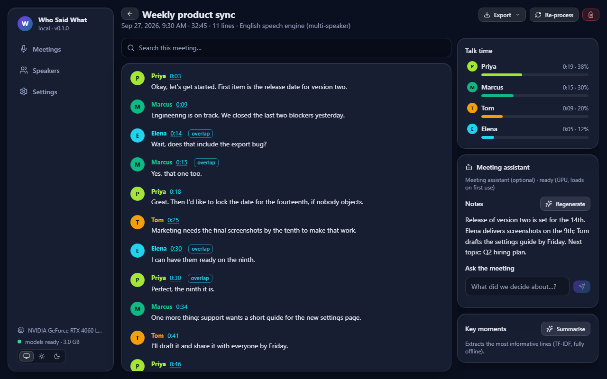
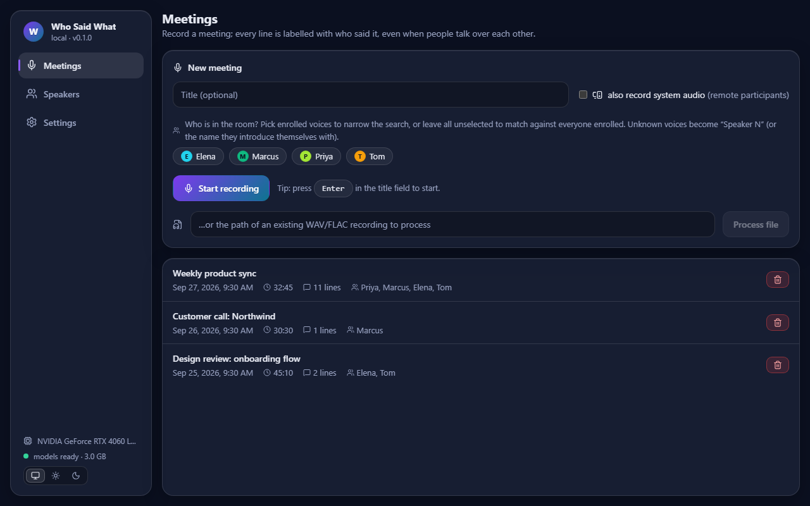

<div align="center">

# 🎙️ Who Said What

### Meeting transcripts that know who spoke.

**Names on every line · Handles people talking at once · Runs 100% on your PC**

[](https://github.com/Hydra-Of-Malice/who-said-what-desktop-executable/releases/latest)




</div>

Who Said What records a meeting and writes down every sentence with the name of the person who said it, live, while the meeting is running. Use it for team stand-ups, client calls on Teams, Zoom or Meet, interviews, and lectures. Nothing is uploaded: the audio, the transcript and the voices stay on your computer.

## 💡 Why you'll like it

| | |
|---|---|
| 🏷️ **Real names** | Each person reads a short passage once. After that the transcript says "Priya", not "Speaker 2". |
| 🗣️ **Overlap aware** | When two or more people talk at the same time, each sentence still lands on the right person. |
| 🔒 **Private by design** | No account, no cloud, no upload. It works with the network cable unplugged. |
| ⚡ **Live** | Lines appear about a second after they are spoken. A final pass tidies the timing when you stop. |
| 🌍 **40 languages** | Switch to the multilingual engine for Hindi, Spanish, French, German, Japanese and more. |
| 💻 **Online calls too** | Turn on system audio to capture the people on the other end of a call. |
| 📤 **Yours to keep** | Search a meeting, rename a speaker, export to Markdown, SRT subtitles or JSON. |

## 🚀 Three steps



1. **Enroll your voices.** Each person reads a short passage for about 30 seconds, once.
2. **Start the meeting.** Pick who is in the room and press Start recording.
3. **Read and export.** Open the transcript, search it, fix a name if needed, and export it.

## 📥 Download

1. Open the [latest release](https://github.com/Hydra-Of-Malice/who-said-what-desktop-executable/releases/latest).
2. Download **all four installer files** into one folder: the `.exe` and the three `.bin` parts (about 5 GB in total).
3. Run `WhoSaidWhat-Setup-<version>.exe`. No administrator password is needed.
4. Windows SmartScreen will say "Windows protected your PC", because this build is not code-signed. Click **More info**, then **Run anyway**.
5. Leave "Start Who Said What now" ticked. The first start takes one to two minutes; later starts take about ten seconds.

Installation takes about two minutes. If a download looks damaged, compare it with `SHA256SUMS.txt` from the release:

```powershell
certutil -hashfile WhoSaidWhat-Setup-0.1.1-1.bin SHA256
```

| Requirement | Details |
|---|---|
| Windows | Windows 10 (version 1809 or newer) or Windows 11, 64-bit |
| Graphics card | NVIDIA with 6 GB of video memory or more. 8 GB recommended. |
| Driver | NVIDIA driver 580 or newer. Older drivers (525 to 579) and GTX 10-series or older cards also work: the app downloads a matching 2 GB component on the first start. [Get drivers](https://www.nvidia.com/drivers) |
| Disk | About 9 GB for the app, plus your recordings |
| Internet | Not needed to install or use, with a current driver. See the driver row for the one exception. |
| Microphone | Any. A headset or a table microphone gives better names than a laptop microphone far away. |
| Not supported | AMD and Intel graphics, computers without a graphics card, macOS, Linux |

## 🔍 What it does

| Stage | What happens |
|---|---|
| Enroll | A 30 second voice sample becomes a voice fingerprint. The app checks the sample for noise, clipping and length. |
| Record | The microphone, and optionally the sound your speakers play, is captured. |
| Separate | The app works out who is speaking at every moment, for up to 8 people. |
| Transcribe | Each person's speech is turned into text, also while others are talking. |
| Name | Voices are matched to the enrolled fingerprints. Unknown voices become "Speaker N", or the name they introduce themselves with. |
| Final pass | When you stop, timing and overlap markers are refined. |
| Review | Search, rename speakers, see talk time per person, pull out key moments. |
| Export | Markdown, SRT subtitles or JSON. |

## ⚙️ How it works

```text
 microphone ──┐
              ├──► who speaks when ──► speech to text ──► names ──► transcript
 system audio ┘         (GPU)              (GPU)        (voice         │
                                                      fingerprints)    ▼
                                                              search · export
```

| Component | Purpose | License |
|---|---|---|
| Who Said What app | Recording, transcript, search, export, interface | All rights reserved |
| Speech engines | Speaker separation, speech to text, voice fingerprints. They run on your graphics card. | Third-party, bundled under their own open licenses |
| Microsoft Edge WebView2 | Shows the app window. Part of Windows 11. | Microsoft |

## 🛡️ Responsible use

Recording people without their knowledge is illegal in many places. Tell everyone in the meeting that it is being recorded and transcribed, and get consent where the law asks for it. A voice fingerprint is personal data: enroll only people who agreed to it, and delete a voice in the Speakers page when someone asks.

## ⚠️ Known limits

- This is a test build. It was developed and tested on one laptop with an RTX 4060 (8 GB). Other graphics cards should work but are not yet confirmed.
- RTX 50-series cards failed on the first start in version 0.1.0. Since 0.1.1 the installer carries the component these cards need, so nothing is swapped on the first start. This was tested on an RTX 4060 with the same component, not yet on a real RTX 50 card.
- There is no CPU-only mode. Without an NVIDIA graphics card the app installs but cannot transcribe.
- The installer is not code-signed, so Windows shows a warning.
- Names depend on the enrollment sample. A noisy sample or a different microphone lowers the accuracy.
- With system audio on and loudspeakers in use, the microphone is turned down while the speakers play. Headphones give better results.
- The English engine is the most accurate with overlapping speech. The multilingual engine covers 40 languages, and accuracy differs per language.
- Very short remarks ("yes", "okay") are sometimes given to the wrong person.
- The optional meeting assistant is not part of the installer.

## 🛠️ Development

This repository holds the installer downloads only. The app's source code is not public.

To check a download against the published checksums:

```powershell
Get-FileHash .\WhoSaidWhat-Setup-0.1.1.exe -Algorithm SHA256
```

| Folder / file | Contents |
|---|---|
| `README.md` | This page |
| `docs/` | Screenshots used on this page |
| [Releases](https://github.com/Hydra-Of-Malice/who-said-what-desktop-executable/releases) | The installer files and checksums |

Found a problem? Open an [issue](https://github.com/Hydra-Of-Malice/who-said-what-desktop-executable/issues) and attach `launcher.log` and `app.log` from `%LOCALAPPDATA%\WhoSaidWhat`.

## 📄 License

All rights reserved. The test build is free to install and use for evaluation. The bundled third-party components keep their own licenses.
